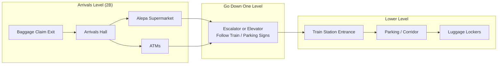

# Helsinki Airport (HEL) Quick Guide: Arrivals to Luggage Lockers

Here’s a dead-simple walk path from Arrivals → lockers at Helsinki Airport, using obvious landmarks so you don’t have to think:

🧭 Step-by-step (Terminal 2 – main Arrivals)
Exit baggage claim into Arrivals Hall (2B)
You’ll walk through the sliding doors into a wide open hall
Look for:
Big “Arrivals” signage overhead
People waiting, café counters, info screens
Orient yourself: look for the “Alepa” grocery store
This is a bright, well-lit supermarket (very noticeable)
It’s one of the most reliable landmarks in Arrivals

👉 If you see Alepa, you’re in the right zone.

Look for signs to:
“Railway Station / Trains”
“P” (Parking) / “P2–P5”
Sometimes also “Baggage Storage / Lockers”

👉 These signs all point you in the same general direction (downward)

Take the escalator or elevator DOWN one level
Usually near the train station signs
You’re going toward the basement / transport level
At the lower level, follow “Lockers / Luggage Storage” signs
You’ll be in a more concrete / transit-style area
Near:
Train station entrance gates
Parking access corridors
Find the locker area
Look for:
A wall or section with rows of metal lockers
Payment kiosks or card terminals

👉 It’s not hidden — once you’re there, it’s obvious.

🧠 Visual summary (super short)
Exit Arrivals → spot Alepa supermarket
Follow Train / Parking signs
Go down one level
Follow Lockers signs → near train station area
⏱️ Time & difficulty
~3–5 minutes walk total
Very straightforward, all indoors

If something feels off, just ask any staff for “matkatavarasäilytys” (Finnish for luggage storage) — they’ll point you instantly.

---

### How to read this like a map
  - Left → right = your walking direction
  - Top section = Arrivals hall
  - Middle = going downstairs
  - Bottom = where lockers actually are

### 🧠 Mental picture (even simpler)
  - You exit → see open hall + Alepa
  - Head toward train signs
Go down one level
Walk toward train station → lockers nearby
---

💰 Locker pricing (at the airport)
Typical range: €6 – €12 per locker (per 24 hours)
Some sources show:
Around €5–€6 for smaller lockers
Around €10–€12 for larger ones

👉 Even if you only use it for 7–10 hours, you’ll usually pay the full-day rate.

---
Yes — **you’ll have no problem finding ATMs on the way from Arrivals to the lockers 👍**

### 🏧 Where the ATMs are

* There are **multiple ATMs throughout Helsinki Airport**, including:

  * **Arrivals hall (Terminal 2, Hall 2B)**
  * Other spots around the terminal and service floor ([iFly][^1])
* They’re typically **24/7 and accept international cards** ([iFly][^1])

---

### 🧭 Relative to your path (Arrivals → lockers)

* Lockers are on the **ground/P level of the terminal** ([Airport Locker Guide][^2])
* The Arrivals hall (where you exit baggage claim) is **right in that same general area**

👉 So practically:

* You’ll **walk past or very near ATMs before reaching lockers**
* No detour needed — it’s all in the same zone

---

### 💡 Practical tip

* Lockers may take **cards (common in Finland)**, but:

  * Having **some euros from an ATM is a safe backup**
* Finnish ATMs (like “Otto”) are **very reliable and easy to use**

---

## ✅ Bottom line

* **Yes — ATMs are right there in Arrivals**
* You’ll encounter them **before or on the way to the lockers**
* No need to hunt around the airport

---

[^1]: https://www.ifly.com/airports/helsinki-airport/ATM-banks-currency?utm_source=chatgpt.com "Helsinki-Vantaa Airport HEL ATM, Bank, Currency Guide- iFLY"
[^2]: https://airportlocker.guide/finland/helsinki-airport-lockers?utm_source=chatgpt.com "Helsinki Airport Lockers - Airport Locker Guide"
