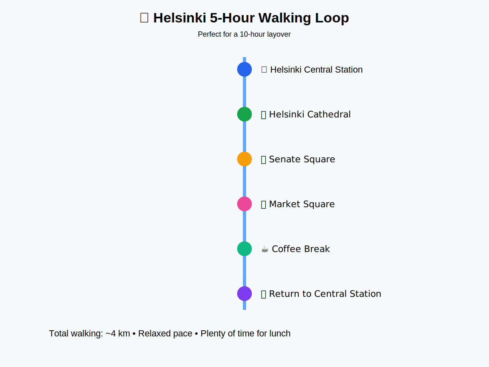
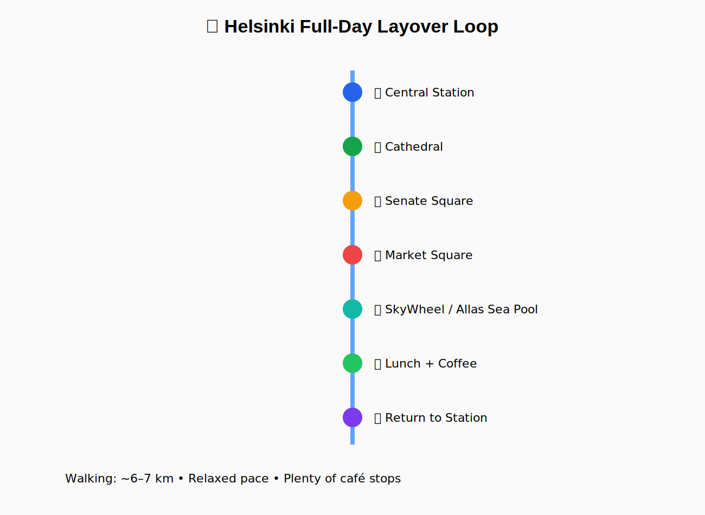

# 🚆 Helsinki Airport (HEL) Long Layover Survival Guide

## Part 2 — Getting to Helsinki & Making the Most of Your Layover (2026 Edition)

> **Last Verified:** June 30, 2026
>
> 📍 Starting Point: Helsinki Airport Railway Station
>
> 🎯 Goal:
>
> Leave the airport with confidence, enjoy Helsinki without rushing, and return with plenty of time for your onward flight.

---

# 🎯 Mission

By the end of this guide you will:

✅ Know which train to board.

✅ Know how to pay.

✅ Know exactly how much time you have.

✅ Visit Helsinki without worrying about missing your flight.

---

# 😌 Take a Breath

Congratulations.

You've already completed the hardest part.

Your luggage is stored.

Your passport is safe.

Your phone is charged.

Now comes the easy part.

---

# 🚆 Step 1 — Find the Platform

🕒 **Time Required:** 2–5 minutes

From the luggage storage area, simply continue following signs for:

🚆 **Railway Station**

Unlike many large airports, Helsinki Airport's railway station is integrated directly beneath the terminal.

No shuttle buses.

No taxis.

No terminal transfers.

Just follow the signs.

---

## 👀 Success Looks Like This

You should now see:

🚉 Train platforms

🚆 Digital departure boards

👥 Commuters

🚪 Platform access

If you do...

✅ You're exactly where you should be.

---

# 🤔 Which Train Do I Take?

This is the question everyone asks.

Fortunately...

The answer is simple.

You can take either:

🟣 **I Train**

or

🟢 **P Train**

Both travel in a loop.

Both stop at:

> 🚉 **Helsinki Central Station**

The only difference is **which direction they travel around the loop**.

### ✈️ Airport Brain Rule

Don't wait for a specific letter.

Board the **first I or P train** heading toward Helsinki.

---

> [!TIP]
> 🚆 If you're unsure, ask:
>
> **"Does this train stop at Helsinki Central Station?"**
>
> The answer will almost always be yes.

---

# 💳 Step 2 — Buying a Ticket

The easiest option in 2026 is also the one most visitors use.

## Option 1 ⭐ Recommended

Simply use your:

💳 Visa

💳 Mastercard

📱 Apple Pay

📱 Google Pay

at the contactless reader before boarding.

No paper ticket.

No vending machine.

No Finnish language menus.

No stress.

---

## Option 2

Purchase a ticket using:

📱 HSL App

Recommended if:

* you're staying longer
* making multiple journeys
* purchasing day passes

Download:

https://www.hsl.fi/en

---

## Option 3

🎫 Ticket Machines

Available in the station if you prefer a physical ticket.

---

# 🎫 Which Ticket Do I Need?

For travel between:

✈️ Helsinki Airport

and

🏙️ Helsinki City Centre

You'll need an:

## 🎫 ABC Ticket

Don't worry.

The ticket machines and HSL app make this very clear.

---

> [!NOTE]
> Fare prices are updated periodically by HSL. Rather than listing a fixed amount that may become outdated, this guide recommends checking the current fare in the HSL app or at the ticket machine before purchase.

---

# 🕒 How Often Do Trains Run?

Typically:

🚆 Every 10–15 minutes during the day.

Slightly less frequently late at night.

You almost never need to plan around a timetable.

Just walk to the platform.

The next train is usually arriving soon.

---

# ⏱️ Journey Time

Airport

⬇️

🚆 Train

⬇️

Helsinki Central Station

≈ **30–35 minutes**

That's it.

No transfers required.

---

# 📶 Free Wi-Fi?

You already have airport Wi-Fi.

Once on the train:

📱 Mobile data usually provides better connectivity.

Download maps before leaving the airport if possible.

---

# ☕ Airport Brain Tip

Don't spend twenty minutes trying to save €1 on the "perfect" ticket.

Time is more valuable than tiny savings during a layover.

Choose the easiest option and get moving.

---

# 🗺️ How Much Time Do You Actually Have?

This depends on your layover.

Let's subtract some time.

---

## Example

You have:

🕒 12-hour layover

Subtract:

🛄 Arrival procedures

≈ 1 hour

🚆 Airport → City

≈ 35 minutes

🚆 City → Airport

≈ 35 minutes

✈️ Return before departure

≈ 3 hours

That leaves roughly:

## 😄 **7 hours in Helsinki**

That's plenty.

---

# 🎯 Layover Planner

| Layover | Free Time in Helsinki | Recommendation           |
| ------- | --------------------: | ------------------------ |
| 10 hr   |              ~5 hours | Excellent                |
| 12 hr   |              ~7 hours | Ideal                    |
| 14 hr   |              ~9 hours | Relaxed sightseeing      |
| 16+ hr  |     Almost a full day | Explore at your own pace |

---

# 🚶 Walking Distances

One of Helsinki's biggest strengths is that many attractions are close together.

Approximate walking times from Helsinki Central Station:

🏛️ Senate Square

10–12 min

⛪ Helsinki Cathedral

12 min

🛍️ Market Square

15 min

⛴️ Allas Sea Pool

18 min

🎡 SkyWheel

20 min

☕ Café stop

Every few minutes 😊

---

# 🎯 Recommended Strategy

Don't try to see everything.

Choose **one** area.

Explore it slowly.

Eat well.

Enjoy the atmosphere.

Then head back.

Quality beats quantity.

---

# 🍽️ If You're Hungry

Excellent choices near the city centre include:

🥐 Finnish cafés

☕

Cinnamon buns

🐟 Salmon soup

🫐 Berry pastries

🦌 Finnish game dishes (if you're curious)

There's no need to book ahead for most casual restaurants during the day.

---

# ☕ Coffee Culture

Finns consume more coffee per person than almost anywhere else in the world.

Take advantage of it.

Find a café.

Slow down.

Recharge.

You don't have to spend every minute sightseeing.

---

# 🌦️ Weather Reality Check

Weather changes quickly.

Carry:

🧥 Light jacket

☔ Compact umbrella

🧣 Extra layer outside summer

Even sunny mornings can become cool later in the day.

---

# 🧭 Navigation

Google Maps works extremely well.

Apple Maps also performs well.

Street signs are clear.

English is widely spoken.

Getting lost is surprisingly difficult.

---

# 🔒 Is Helsinki Safe?

Generally:

✅ Yes.

Helsinki consistently ranks among Europe's safer capitals.

Normal precautions still apply.

Keep:

🛂 Passport

💳 Wallet

📱 Phone

with you.

Watch your belongings in crowded places just as you would anywhere else.

---

# 🎯 Airport Brain Tip

Your mission isn't to "see Helsinki."

Your mission is to enjoy Helsinki **without creating stress for your next flight.**

If something takes longer than expected...

Skip it.

There will always be another café.

Another museum.

Another view.

Missing your flight isn't worth squeezing in one more attraction.

---

# 📋 Before Leaving Helsinki City Centre

Ask yourself:

✅ Passport?

✅ Phone?

✅ Wallet?

✅ Camera?

✅ Souvenirs?

✅ Enough battery?

✅ Know which train you're taking back?

If yes...

Enjoy the rest of your day.

---

# 🚶 Recommended Walking Routes

One of Helsinki's greatest strengths is that its city centre is compact.

Unlike many European capitals, you won't spend your day riding buses or metros between attractions.

Most highlights are within comfortable walking distance.

## 🎯 Choose Your Adventure

| Time Available | Route                      |
| -------------- | -------------------------- |
| 🕔 ~5 hours    | Essentials Loop            |
| 🕖 ~7 hours    | Relaxed Explorer           |
| 🕘 8–9 hours   | Full Waterfront Experience |

---

# 🕔 Route 1 — Helsinki Essentials Loop

**Perfect for a 10-hour layover**

🗺️ See:

* 🚉 Helsinki Central Station
* ⛪ Helsinki Cathedral
* 🏛️ Senate Square
* 🐟 Market Square
* ☕ Finnish café
* 🚆 Return

---

## Estimated Timeline

| Time  | Activity                     |
| ----- | ---------------------------- |
| 00:00 | 🚆 Arrive at Central Station |
| 00:15 | 🚶 Walk to Cathedral         |
| 00:45 | 📸 Explore Senate Square     |
| 01:30 | 🛍️ Browse Market Square     |
| 02:15 | 🍽️ Lunch                    |
| 03:30 | ☕ Coffee & pastry            |
| 04:30 | 🚶 Return to station         |
| 05:00 | 🚆 Train back to airport     |

Very relaxed.

No rushing.

---

# 🕖 Route 2 — Relaxed Explorer

If your layover is around 12 hours, you've earned a slower pace.

Add:

🎨 A museum

🛍️ Some shopping

🌳 Esplanadi Park

Another coffee break (because Finland).

---

# 🕘 Route 3 — Waterfront Explorer

For travelers with 14-hour layovers.

Continue beyond Market Square to:

🎡 SkyWheel Helsinki

🏊 Allas Sea Pool

🌊 Waterfront promenade

🍺 Outdoor cafés (summer)

❄️ Cozy indoor cafés (winter)

---

# ☕ Coffee Stops Worth Your Time

Instead of grabbing coffee at the first place you see...

Consider slowing down.

Finland takes coffee seriously.

A proper coffee break is part of the experience.

Recommended choices near the city centre include:

☕ Fazer Café

☕ Café Engel

☕ Robert's Coffee

☕ Espresso House

You really can't go wrong.

---

# 🥐 Don't Leave Without Trying...

If this is your first visit to Finland...

Try at least one of these:

🥮 Korvapuusti (Finnish cinnamon bun)

🐟 Salmon soup

🫐 Berry pie

🥔 Karelian pie

🧈 Egg butter

☕

Yes...

Order coffee too.

---

# 📸 Best Photo Stops

If you're collecting passport stamps...

You're probably collecting photos too.

Don't miss:

📷 Helsinki Cathedral steps

📷 Senate Square

📷 Market Square

📷 Waterfront

📷 Helsinki Central Station clock tower

---

# 🧠 Airport Brain Tip

You don't need to "complete" Helsinki.

You only need one memorable afternoon.

Walk slowly.

Sit in a café.

Watch the trams.

Listen to the seagulls.

Enjoy the fact that you're in Finland.

That's a far better memory than sprinting between attractions.

---

# 🧳 Time to Head Back?

If you're starting to think:

> "Maybe one more coffee..."

It's probably time to head back toward Central Station.

Part 3 will tell you exactly when to board your return train so you arrive at the airport with plenty of time to spare.
